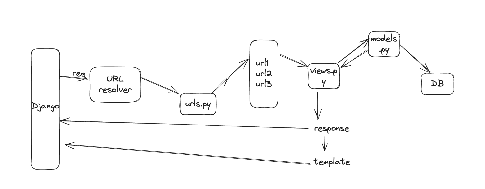

## Basic Flow:

###Basic:
* templates - HTML and static - CSS
* Views -> render
* make changes in settings.py -> add templates (for HTML)
* template engine (for CSS) - 
* again make changes in settings.py
* You can make many apps, use urls to handover control. Use layouts for templating.

### Models:
* one to one -> Cars and Car Certificate
* many to many -> Cars and Stores
* One to many -> Cars and Reviews
* make migrations -> python manage.py makemigrations
* migrate -> python manage.py migrate

###Admin:
* python manage.py createsuperuser
* python manage.py runserver    
* admin.py -> for admin panel

* Forms:
* forms.py -> for forms and validation  

### BasicCommands
* python manage.py startapp demo -> for new apps
* python manage.py runserver -> to run server

